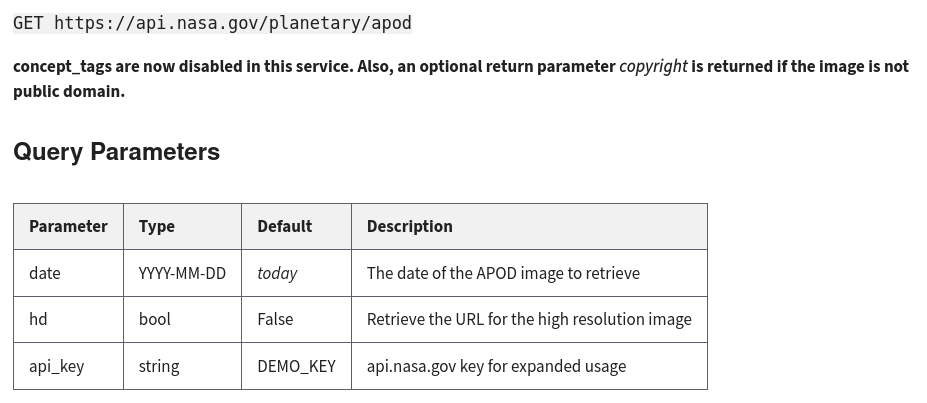
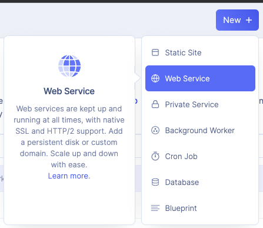
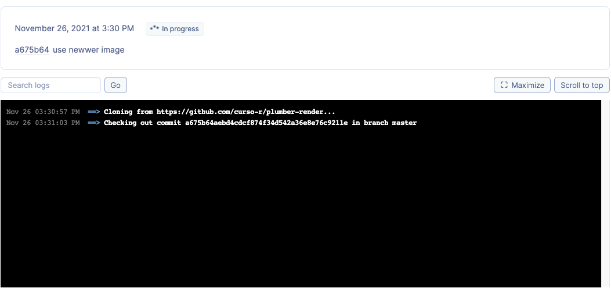

```{r, include=FALSE, warning=FALSE, message=FALSE}
options(htmltools.dir.version = FALSE)
knitr::opts_chunk$set(comment = "#>", echo=TRUE, fig.align='center')
```

class: inverse, center, middle
# Prólogo

---
# Curso-R

```{r, echo=FALSE, fig.align='center', dpi=280}
knitr::include_graphics("static/nos.png")
```

---
# Linha do tempo

```{r, echo=FALSE, fig.align='center', dpi=130}
knitr::include_graphics("static/cursor.png")
```

---
# Sobre o curso

- Alguns lembretes:
  
  - O curso ocorre das **9:00 às 13:00**
  
  - A **gravação** do curso ficará disponível para todos por 1 ano
  
  - Todos se tornarão membros preferenciais no nosso **Discourse**
  
  - Intervalos de 10 minutos ao decorrer da aula. Provavelmente 3 intervalos por aula.


---
# Conteúdo

- O que é deploy (implantação)

- O que é uma API

- O pacote `{plumber}`

- O que é Docker

- Deploy usando [Render.com](https://render.com)

- O que é GitHub Actions

- O que é GitHub Packages

- O pacote `{golem}`

- Deploy na Google Cloud

---
# Está tudo preparado?

- Conta GitHub

- Conta Render.com

- Conta Google

- Cadastro no Google Cloud

- Conta Docker Hub

- Instalação R e RStudio

- Instalação `{plumber}`, `{tidyverse}`, `{golem}`

---
class: inverse, center, middle
# Introdução

---
# O que significa "deploy"?

> Implantação de software são todas as atividades que tornam um sistema
disponível para uso

- No geral, colocar um software em produção envolve uma série de passos e
técnicas simples e complexos

  - Tirar o código do seu computador e colocá-lo em um **servidor**
  
  - Permitir que o software seja **atualizado** sempre que necessário
  
  - Garantir a **estabilidade** do serviço levando em conta a quantidade de usuários
  
  - **Disponibilizar** o software de forma útil para o usuário final
  
  - Não perder a cabeça no caminho...

---
# Exemplos de implantação

- Disponibilizar uma API

  - **Produto**: código que realiza uma tarefa específica dada uma entrada
  
  - **Objetivo**: permitir que um usuário faça uma chamada para o software e
  receba a resposta desejada
  
  - **Implantação**: servir a API em uma máquina remota

- Transformar um dashboard em um site:

  - **Produto**: código que, quando executado, exibe um dashboard interativo
  
  - **Objetivo**: ter um endereço fixo que, quando acessado, exibe o dashboard
  
  - **Implantação**: servir o dashboard em uma máquina remota

---
class: inverse, center, middle
# APIs

---
# O que é uma API?

> _Application Programming Interface_ (API) é uma interface de computação que
define interações entre múltiplos softwares intermediários

- Essencialmente uma API é uma forma de um computador falar com outro sem
precisar de um humano

- Uma API define:

  - As **chamadas e requisições** que podem ser feitas (e como fazê-las)
  
  - Os **formatos** de dados que podem ser utilizados
  
  - As **convenções** a serem seguidas

- Hoje falaremos especificamente de APIs REST em [HTTP](https://developer.mozilla.org/pt-BR/docs/Web/HTTP/Overview), ou seja, **APIs para
serviços web**

---
# API HTTP

```{r, echo=FALSE, fig.align='center', dpi=115}
knitr::include_graphics("static/api-rest.png")
```

---
# Vantagens e desvantagens

- `r emo::ji("+1")` O usuário não precisa entender nada sobre a linguagem de programação em que ela foi desenvolvida, apenas saber fazer requisições HTTP.

- `r emo::ji("+1")` Elas podem ser executadas em servidores separados da aplicação que está consumindo-a de forma muito simples. 

- `r emo::ji("+1")` Em geral, são fáceis de escalar horizontalmente, basta adicionar mais máquinas p/ atender as requisições.

- `r emo::ji("-1")` Quando a latência (tempo p/ responder) é muito importante: neste caso ter que fazer uma requisição HTTP pode ser muito caro.

- `r emo::ji("-1")` Quando você quer passar uma grande quantidade de dados. Eg, transferir arquivos com alguns GB's. Neste caso, protocolos como FTP/FTPS podem ser mais adequados.

---
# Exemplo de API

- Um exemplo de API **sem autenticação** é a PokéAPI: https://pokeapi.co/docs/v2

- A **documentação** é provavelmente o melhor lugar para entender uma API:

```{r, echo=FALSE, fig.align='center'}
knitr::include_graphics("static/pokeapi.png")
```

- Uma API não deixa de ser um "link" que aceita parâmetros e retorna dados

  - Qual a diferença entre um site e uma API?

---
# PokéAPI

- Este **endpoint** recebe o nome de um Pokémon e retorna uma lista de dados

```{r}
library(httr)
(resposta <- GET("https://pokeapi.co/api/v2/pokemon/ditto"))

content(resposta)$moves[[1]]$move$name
```

---
# Exemplo de API com autenticação

```{r, echo=FALSE}
NASA_KEY <- Sys.getenv("NASA_KEY")
```

- exemplos de APIs **com autenticação** são as da NASA: https://api.nasa.gov/

- APIs podem receber parâmetros que alteram o seu comportamento (p.e. chave)

```{r, echo=FALSE, fig.align='center', dpi=115}

```

---
# APOD API

- Este **endpoint** retorna a "foto astronômica do dia" para uma certa data

```{r}
params <- list(
  date = "2019-12-31",
  api_key = NASA_KEY # Guardada no meu computador
)

resp <- GET("https://api.nasa.gov/planetary/apod", query = params)
content(resp)$url
```

- Neste caso, ainda podemos utilizar a resposta da API para exibir uma imagem

  - Poderíamos, por exemplo, implementar um **site que consulta** essa API

---
background-image: url(https://apod.nasa.gov/apod/image/1912/M33-HaLRGB-RayLiao1024.jpg)
background-size: cover

---
# O pacote {plumber}

> Um pacote R que converte o seu código R pré-existente em uma API web usando
uma coleção de comentários especiais de uma linha

- Qualquer função que recebe uma entrada bem definida e retorna uma saída
estruturada pode se tornar uma API

- Casos de uso:

  - Retornar entradas de uma **tabela**
  
  - Aplicar um **modelo** (vide https://decryptr.netlify.app/)
  
  - Inicializar um **processo externo**
  
  - Muito mais...

---
# Exemplo de {plumber}

- Para criar uma **API local** com o `{plumber}`, basta comentar informações
sobre o endpoint usando `#*`

```{r, eval=FALSE}
library(plumber)

#* Escreve uma mensagem
#* @param msg A mensagem para escrever
#* @get /echo
function(msg = "") {
  paste0("A mensagem é: '", msg, "'")
}
```

- A função precisa estar salva em um arquivo para que possamos invocar os poderes
do `{plumber}` no mesmo

---
# Invocando a API

- Para implantar a API **localmente**, basta rodar os dois comandos a seguir

```{r, eval=FALSE}
api <- plumb("arqs/01_exemplo_api.R")
api$run(port = 8000)
```

- A função `run()` inicializa a API em http://localhost:8000 (dependendo da
**porta** escolhida)

```{r, eval=FALSE}
params <- list(msg = "Funciona!")
resp <- GET("http://localhost:8000/echo", query = params)

content(resp)[[1]]
```

`#> [1] "A mensagem é: 'Funciona!'"`

---
# Swagger

- Swagger é essencialmente uma API que ajuda a criar APIs, incluindo uma
interface com **documentação** em http://localhost:8000/__docs__/

```{r, echo=FALSE, fig.align='center', dpi=130}
knitr::include_graphics("static/swagger.png")
```

---
# Uma nota sobre REST

> _Representational State Transfer_ (REST) é um estilo de arquitetura de
software que define um conjunto de restrições a serem utilizadas para criar um
serviço web

- O _Hypertext Transfer Protocol_ (HTTP) é a base para toda a **Web**
(≠ Internet)

  - Ele define uma série de **métodos de requisição** para que um computador
  seja capaz de "pegar" e "mandar" conteúdo da/para a Internet
  
  - `GET` pega, `POST` envia e assim por diante

- REST usa os comandos HTTP para definir as mesmas operações, mas **sem estado**

  - Um site requer uma interação permanente com o usuário, enquanto uma API
  realiza **operações instantâneas**

---
# Exemplo de POST

- Um **endpoint** POST normalmente recebe dados, esse é um exemplo simples

```{r, eval=FALSE}
#* Retorna a soma de dois números
#* @param a O primeiro número
#* @param b O segundo número
#* @post /sum
function(a, b) {
  as.numeric(a) + as.numeric(b)
}
```

```{r, eval=FALSE}
params <- list(a = 2, b = 4)
resp <- POST("http://localhost:8000/sum", body = params, encode = "json")

content(resp)[[1]]
```

`#> [1] 6`

---
class: inverse, center, middle
# Docker

---
# O que é Docker?

> Docker é uma _platform as a service_ (PaaS) que usa virtualização de sistemas
operacionais para implantar softwares em "contêineres"

- O Docker não passa de um programa que roda no seu computador e permite
criar e usar **contêineres**

- Contêineres são máquinas virtuais (mais sobre isso a seguir) "superficiais",
acessíveis somente pela linha de comando

- Contêineres são **isolados** entre si e empacotam seu próprio **software**,
bibliotecas e configuração

- Contêineres são construídos em cima de **imagens**, modelos que descrevem os
componentes da máquina virtual

- Para testar, acesse https://labs.play-with-docker.com/

---
# Docker vs. VM

- Note as vantagens e desvantagens de cada arquitetura

```{r, echo=FALSE, fig.align='center', dpi=130}
knitr::include_graphics("static/dockervm.png")
```

---
# Docker e o sistema operacional

- Docker roda em uma camada acima do sistema operacional hospedeiro e portanto usa recursos deste.

- A principal diferença quando comparado a uma VM é que imagens construidas em um OS não são necessáriamente compatíveis com outros OS's.

- **Lembre**: Dockerfile's e imagens construidos no Windows são bem diferentes dos que são construidos para sistemas unix (Linux/MacOs). 

- Em geral, queremos Dockerfile's p/ sistemas unix pelo fato de que é muito mais prático/barato na hora de alugar um servidor na nuvem.

- Quer quer testar Docker de unix no Windows pode utilizar o [WSL](https://docs.microsoft.com/pt-br/windows/wsl/about) *Windows Subsystem for Linux* que permitte executar essas imagens.

---
# Dockerfile

- Grande parte das imagens Docker já estão disponíveis no **Docker Hub** (como
um CRAN do Docker)

  - Inclusive, lá estão várias imagens específicas para R, incluíndo RStudio
  Server, Shiny, etc. https://hub.docker.com/u/rocker

- Podemos criar uma imagem nova com um **Dockerfile**, um arquivo que especifica
como ela deve ser construída

  - O primeiro componente é sempre a **imagem base** (muitas vezes um sistema
  operacional)
  
  - A seguir vêm os comandos de **configuração**
  
  - Por fim, o **comando** a ser executado pelo contêiner

---
# Exemplo de Dockerfile

- A base já foi feita pelo autor do `{plumber}` e tem tudo que precisamos

- Copiamos o arquivo para **dentro do contêiner** de modo a utilizá-lo

- **Expor a porta** 8000 é necessário porque ela é onde a API será servida

- O **comando** de execução deve ser o caminho para o arquivo fonte da API (isso
está descrito na documentação)

```{}
FROM rstudio/plumber

COPY exemplo_api.R /

EXPOSE 8000/tcp
CMD ["/exemplo_api.R"]
```

---
# Exemplo de imagem e contêiner

- Para criar a imagem, é necessário estar dentro do diretório do Dockerfile

- O comando `docker build` monta uma imagem a partir do Dockerfile e seus
arquivos associados e dá um nome para a mesma (argumento `-t`)

- O comando `docker run` executa uma imagem, criando um contêiner

  - O argumento `-p` indica a porta a ser servida no hospedeiro e a porta
  original
  
  - O argumento `--rm` limpa o armazenamento depois que tudo acaba

```{}
cd arqs/02_exemplo_docker/

docker build -t exemplo .

docker run -p 8000:8000 --rm exemplo
```

---
class: inverse, center, middle
# Deploy no Render.com

---
# Deploy no Render.com

Render.com é uma PaaS (*Plata forma como Serviço*) que permite hospedar serviços Web, bancos de dados entre outros tipos de aplicações.

- Tem suporte p/ imagens Docker.

- Permite utilizar domínios customizados.

- Possui serviço de **autoscaling**.

- Tenta ser o mais simples possível p/ configurar.

- Tem bom suporte para workflows com Git/GitHub.

Alternativas: [Heroku](https://www.heroku.com/), [Google Cloud Run](https://cloud.google.com/run?utm_source=google&utm_medium=cpc&utm_campaign=latam-BR-all-pt-dr-BKWS-all-all-trial-e-dr-1009897-LUAC0008673&utm_content=text-ad-none-any-DEV_c-CRE_434184323500-ADGP_Hybrid%20%7C%20BKWS%20-%20EXA%20%7C%20Txt%20~%20Compute_Cloud-Run-KWID_43700066419106882-kwd-680158540998&utm_term=KW_google%20cloud%20run-ST_Google%20Cloud%20Run&gclid=CjwKCAiAqIKNBhAIEiwAu_ZLDoAgj_q8nXt5GIIzvzYhFJiiWznqRs9c6ejUV77jmzA5Jc-S-_QQMBoCcyUQAvD_BwE&gclsrc=aw.ds), [Platform.sh](https://platform.sh/) e [AWS Lambda](https://docs.aws.amazon.com/lambda/latest/dg/welcome.html)

---
# Implantação

1. Criar um repositório no Git com seu **Dockerfile** e código necessário p/ executar a sua API.

2. Clicar em New > Web Service

```{r echo=FALSE, fig.align='center', dpi=130}

```

---
# Implantação

3. Selecionar o repositório na lista.

4. Aguardar o *build*! `r emo::ji("award")`


```{r echo=FALSE, fig.align='center', dpi=130}

```

---
class: inverse, center, middle
# GitHub Actions

---
# Implantação contínua

> Em engenharia de software, CI/CD refere-se genericamente à combinação das
práticas de integração contínua (CI) e implantação contínua (CD)

- Dado um certo código e um método consistente de implantá-lo, faz todo sentido
**automatizar** o processo

- Implantação contínua normalmente envolve transferir a versão mais
recente/**estável** do software e colocá-la em produção

  - O CD de um serviço encapsulado em Docker necessita automatizar o **build**

  - Existe uma série de serviços que detectam uma nova versão de um
  **repositório** e automaticamente criam atualizam a sua imagem

- Hoje vamos falar sobre o **GitHub Actions** porque ele se conecta facilmente
com o GitHub

---
# GitHub Actions

> GitHub Actions ajuda a automatizar tarefas dentro de seu ciclo de vida de
desenvolvimento de software https://docs.github.com/pt/actions

- Um **workflow** não passa de um processo bem-definido que será executado no
repositório ao qual ele pertence

- Ele é definido a partir de um arquivo YAML dentro da pasta `.github/workflows`

  - É comum definir workflows para testagem de pacotes, geração de documentação, 
  atualização de dados, etc.
  
- O workflow é, essencialmente, um duende mágico que baixa o nosso repositório
em um **servidor do GitHub** e executa os comandos especificados

  - O plano gratuito já funciona para bastante coisa, mas cuidado com os
  **custos** das máquinas MacOS

---
# Estrutura

- Um workflow tem alguns componentes importantes:

  - **Event**: gatilhos que ativam o workflow, podendo ser desde um push ao
  repositório até uma hora do dia
  
  - **Job**: sequências completas de comandos que podem ser executadas
  paralelamente entre si
  
  - **Step**: uma tarefa dentro de um job, composta por ações
      
      - **Use**: passos importados de outro repositório (úteis para setup)
  
  - **Action**: o átomo do workflow, um comando a ser executado pelo "duende
  mágico"
  
- Também é comum definir **env**, variáveis de ambiente para o workflow

---
# Exemplo de workflow

```yaml
on: [push]                                              # Event
jobs:
  R-CMD-check:                                          # Job
    runs-on: ubuntu-latest
    steps:
      - uses: actions/checkout@v2                       # Use
      - uses: r-lib/actions/setup-r@v1                  # Use
      - name: Install dependencies                      # Step
        run: |                                          # Action
          install.packages(c("remotes", "rcmdcheck"))
          remotes::install_deps(dependencies = TRUE)
        shell: Rscript {0}
      - name: Check                                     # Step
        run: rcmdcheck::rcmdcheck(args = "--no-manual") # Action
        shell: Rscript {0}
```

---
# GitHub Packages

> O Package Registry é um serviço de hospedagem que permite a publicação de
pacotes https://docs.github.com/pt/packages

- Antigamente, a única forma de publicar imagens Docker era pelo Docker Hub,
mas agora temos o **Package Registry**

- Com apenas um simples **Dockerfile na raiz** do repositório, é possível subir
uma imagem Docker usando uma GH Action

- Depois que a imagem estiver publicada, basta usar o comando abaixo no terminal
para utilizá-la onde for necessário

```sh
docker pull ghcr.io/USUARIO/REPO
docker run ghcr.io/USUARIO/REPO
```

- Basta modificar o comando `run` conforme a necessidade (portas, etc.)

---
# Publicação de imagem

```yaml
on: [push]
jobs:
  publish-image:
    runs-on: ubuntu-latest
    steps:
      - uses: actions/checkout@v2
      - uses: docker/login-action@v1
        with:
          registry: ghcr.io
          username: ${{ github.actor }}
          password: ${{ secrets.GITHUB_TOKEN }}
      - name: Build the Docker image
        run: |
          docker build -t ghcr.io/USUARIO/REPO .
          docker push ghcr.io/USUARIO/REPO
```

---
class: inverse, center, middle
# Shiny

---
# Shiny empacotado

- Apps começam com uma ideia simples, mas vão **crescendo** até o ponto que não
conseguimos mais entender onde estão os seus pedaços

- Com **módulos**, é possível separar pedaços de um shiny em scripts separados, que
são adicionados como funções dentro do app principal

  - Um módulo pode usar funções de certo pacote, e às vezes esquecemos de checar
  se ele está instalado quando o app for colocado em produção

- Uma alternativa muito útil é desenvolver o shiny dentro de um **pacote**

  - As **dependências** são checadas automaticamente
  
  - Os módulos se tornam **funções** do pacote
  
  - Tudo deve ficar **documentado** e organizado por padrão

---
# O pacote {golem}

> `{golem}` é um framework opinionado para construir aplicações shiny prontas
para produção https://engineering-shiny.org

- O `{golem}` cria **templates** estruturadas que facilitam o desenvolvimento,
configuração, manutenção e implantação de um dashboard shiny

  - A template é um **pacote** R, importante pelos motivos destacados antes
  
  - Contém uma coleção de funções que **aceleram** tarefas repetitivas
  
  - Possui diversos **atalhos** para criar arquivos comuns
  
  - Traz funções que automatizam a preparação para o **deploy**

- Eu pessoalmente acho a template muito carregada, mas muita gente gosta

---
# Exemplo de {golem}

- A função `create_golem()` cria um projeto-pacote com toda a estrutura

  - `R/` deve conter as funções, `dev/` ajuda a montar o shiny e `inst/` fica
  com os recursos auxiliares

```{r, eval=FALSE}
golem::create_golem("arqs/04_exemplo_golem/", package_name = "exemplogolem")
```

- O primeiro passo é passar pelo arquivo `dev/01_start.R` para configurar o app

- O segundo é desenvolver o app (`dev/02_dev.R` pode ajudar)

- O último passo é criar a estrutura para deploy com `dev/03_deploy.R`

  - Nunca esquecer de instalar o app e testar com `exemplogolem::run_app()`

---

```{r, echo=FALSE}
fs::dir_tree("../arqs/04_exemplo_golem/")
```

---
class: inverse, center, middle
# Deploy

---
# Google Cloud Platform

> Google Cloud Platform (GCP) é um conjunto de serviços na nuvem, incluindo
processamento, armazenamento, analytics e machine learning

- A "**nuvem**" é um nome bonito para uma coleção de armazéns ao redor do mundo com
computadores que podem ser alugados

  - Um **servidor** é um computador com um programa que o permite receber
  requisições de outros computadores
  
  - Um **site** é um conjunto de código sendo servido em um servidor, que pode
  ser convertido para uma página visual
  
- A Google oferece sua **infraestrutura** para ser alugada por usuários comuns

  - O GCP é a plataforma onde podemos controlar esses recursos sem nos
  preocuparmos com a **manutenção** do hardware e do software

---
# Preparação para deploy

- Como o shiny é um pacote, podemos seguir os passos de **desenvolvimento** de
pacotes antes de colocá-lo em produção

  - Rodar `devtools::check()` para garantir que tudo está **em ordem**

  - **Instalar** o app com `devtools::install()`
  
  - **Executar o app** em uma sessão limpa com `exemplodeploy::run_app()`

- Quando o shiny estiver pronto, adicionar um **Dockerfile** com `add_dockerfile()`

  - O Dockerfile **não é otimizado** para o Google Cloud e isso pode implicar em
  alguns problemas
  
  - Não esquecer de usar uma GH Action para criar um **GH Package**!

---

```{r, eval=FALSE}
golem::add_dockerfile()
```

```{}
FROM rocker/r-ver:4.1.0
RUN apt-get update && apt-get install -y  git-core libcurl4-openssl-dev libgit2-dev libicu-dev libssl-dev libxml2-dev make pandoc pandoc-citeproc && rm -rf /var/lib/apt/lists/*
RUN echo "options(repos = c(CRAN = 'https://cran.rstudio.com/'), download.file.method = 'libcurl', Ncpus = 4)" >> /usr/local/lib/R/etc/Rprofile.site
RUN R -e 'install.packages("remotes")'
RUN Rscript -e 'remotes::install_version("shiny",upgrade="never", version = "1.6.0")'
RUN Rscript -e 'remotes::install_version("config",upgrade="never", version = "0.3.1")'
RUN Rscript -e 'remotes::install_version("golem",upgrade="never", version = "0.3.1")'
RUN mkdir /build_zone
ADD . /build_zone
WORKDIR /build_zone
RUN R -e 'remotes::install_local(upgrade="never")'
RUN rm -rf /build_zone
EXPOSE 80
CMD R -e "options('shiny.port'=80,shiny.host='0.0.0.0');exemplodeploy::run_app()"
```

---
# Exemplo de deploy no GCP

1. Menu Lateral

1. IAM e administrador

1. Contas de **serviço**

1. Criar conta de serviço

1. Administrador do **Storage** + Administrador do **Compute**

1. Menu Lateral

1. Google Compute Engine

1. Criar **instância**

1. Implante uma **imagem** de contêiner nesta instância de VM

---
# Exemplo de deploy no GCP (cont.)

1. Menu Lateral

1. Rede VPC

1. Firewall

1. Criar regra de **firewall**

1. Intervalos de IP de origem: **0.0.0.0/0**

1. Menu Lateral

1. Rede VPC

1. Endereços **IP externos**

1. Tipo: Temporário > **Estático**

---
# Testando um deploy

> DevOps (desenvolvimento + operações de TI) tem por objetivo acelerar o ciclo
de desenvolvimento e prover CD com software de alta qualidade

- Depois que o deploy estiver pronto (máquina virtual rodando, configurações
realizadas) é essencial testar

- Em um ambiente corporativo em que os riscos são altos, os testes precisam
ocorrer **antes** do deploy

- Muitas vezes é vital ter um **ambiente de testes** bem configurado que simule
todos os problemas pelo qual o programa pode passar

  - Estamos usando a metodologia **XGH**, então testamos só depois de implantar

- Alguns testes: corretude, carga, responsividade, etc.

---
class: inverse, center, middle
# Fim!
